  

  
  
  
  
  
  

# ⚡ Awesome IoT Event Detection & Response

> **Curated List of Commercial SaaS Platforms, Complex Event Processing (CEP) Engines & Open-Source IoT Automation Tools**  
> *Track real-time device telemetry, detect operational anomalies & trigger automated responses across Edge, Fog, and Cloud infrastructure.*

---

## 📖 Overview & Ecosystem Scope

This repository provides an authoritative, SEO-optimized directory of **managed SaaS solutions** and **open-source GitHub projects** designed for **IoT Event Detection and Automated Response**.

Modern IoT networks generate high-velocity telemetry streams. Detecting meaningful events—such as hardware failures, temperature breaches, physical security alerts, or anomalous patterns—requires low-latency **Complex Event Processing (CEP)**, flexible **Rule Engines**, and reliable **Action Workflows**.

---

## 📍 Table of Contents

- [☁️ SaaS & Hosted Enterprise Platforms](#%EF%B8%8F-saas--hosted-enterprise-platforms)
- [🔓 Open-Source GitHub Projects & CEP Engines](#-open-source-github-projects--cep-engines)
- [🛠️ Architecture & Deployment Patterns](#%EF%B8%8F-architecture--deployment-patterns)
- [🤝 How to Contribute](#-how-to-contribute)
- [⚠️ Disclaimer](#%EF%B8%8F-disclaimer)
- [📈 Star History](#-star-history)
- [💖 Support & Sponsorship](#-support--sponsorship)

---

## ☁️ SaaS & Hosted Enterprise Platforms

> 📊 **Market Analysis & Insights**: The global **IoT Analytics & Event Processing Market** is estimated at **~$38.5 Billion in 2026** (projected to reach ~$85 Billion by 2030 at a CAGR of ~22%). The sector is **moderately fragmented**, balancing public cloud hyperscalers (AWS, Azure) providing fundamental stream infrastructure alongside specialized enterprise industrial platforms (PTC ThingWorx, Cumulocity IoT) and agile hyper-automation platforms (Waylay, Losant, ClearBlade)—preventing a strict "winner-take-all" concentration.

| Platform | Company Size / Valuation | Starting Price | Free Tier / Free Trial Limits | Key Features & Best For |
| :--- | :--- | :--- | :--- | :--- |
| **[Azure Stream Analytics](https://azure.microsoft.com/en-us/products/stream-analytics/)** | **$3.92 Trillion** Market Cap *(Microsoft, $331.8B Annual Rev)* | **$0.11 / SU-hour** *(Streaming Unit V2 model)* | **$200 free credit for 30 days** *(Azure Free Account)* | Real-time SQL queries on telemetry stream with automated event triggers. **Best for Azure-native event processing**. |
| **[AWS IoT Events](https://aws.amazon.com/iot-events/)** | **$2.18 Trillion** Market Cap *(Amazon, $128.7B AWS Annual Rev)* | **$0.15 / 1,000 message evaluations** *(+ $0.10 / 100k state changes)* | **2,500 message evaluations / month for 12 months** *(China regions / $300 AWS trial credit)* | Managed complex event processing using conditional "if-then-else" rules across telemetry sources. **Best for AWS-native IoT event detection**. |
| **[Datadog IoT](https://www.datadoghq.com/)** | **$97.2 Billion** Market Cap *($3.43B Annual Rev)* | **$15 / host / month** *(Pro plan, annual billing)* | **14-day free trial** *(Unlimited metrics & platform features)* | Unified infrastructure metrics, log monitoring, and telemetry anomaly alerts for device fleets. **Best for unified IoT & cloud observability**. |
| **[PTC ThingWorx](https://www.ptc.com/)** | **$22.6 Billion** Valuation *(Acquired by Schneider Electric, $2.2B Rev)* | **~$2,000 / month** *($24,000/yr starting enterprise base)* | **30-day developer sandbox trial** *(PTC Developer Portal access)* | Industrial IoT platform with drag-and-drop event processing, AR integration, and asset tracking. **Best for industrial IoT applications**. |
| **[Losant Enterprise IoT](https://www.losant.com/)** | **$2.5 Billion** Parent Valuation *(Acquired by SUSE, $25.2M total funding)* | **$150 / month** *(Starter plan for 500k payload evaluations)* | **Free Developer Sandbox** *(Up to 10 devices & 30-day data retention, no expiration)* | Visual workflow builder, edge compute engine, and device state monitoring. **Best for enterprise IoT event workflows**. |
| **[Cumulocity Streaming Analytics](https://cumulocity.com/docs/2026/streaming-analytics/introduction-analytics/)** | **~$500M - $1 Billion** Valuation *(Backed by Avedon/Schroders; Software AG €2.6B buyout)* | **€299 / month** *(Cloud Tenant starter tier up to 100 devices)* | **30-day free trial** *(Full Analytics Builder CEP & EPL app access)* | Enterprise IoT platform powered by Apama complex event processing engine for drag-and-drop analytics. **Best for enterprise IoT with real-time analytics**. |
| **[Waylay](https://www.waylay.io/platform)** | **$17.9 Million** Valuation *(Acquired by Vertiv, ~$9M Annual Rev)* | **€5 / month** *(Waylay IO Developer Plan)* | **14-day free trial** *(1,000 rule executions & visual flow builder access)* | Low-code hyper-automation unifying time-series telemetry, event streams, and AI automation flows. **Best for workflow-based IoT automation**. |
| **[ClearBlade](https://clearblade.com/)** | **~$15M - $25 Million** Est. Valuation *($6.8M Annual Recurring Rev)* | **$0.0005 / MB** *(Or $50/mo starter cloud package)* | **Free Developer Account** *(5 edge nodes, 100 devices & 10,000 msg/mo)* | Event types with severity/priority levels; triggers actions on MQTT/HTTP lifecycle events. **Best for enterprise IoT event management**. |

---

## 🔓 Open-Source GitHub Projects & CEP Engines

*Open-source options sorted in descending order by **GitHub Star Count**.*

1. **[Huginn](https://github.com/huginn/huginn)**   
   **Agent-based system for building automated event-driven workflows & web monitoring** (~50,000+ stars), MIT licensed. Creates online agents that watch for events, aggregate telemetry signals, and execute actions based on custom logic. **Best for agentic event monitoring and web triggering**.

2. **[Apache Kafka](https://github.com/apache/kafka)**   
   **Distributed event streaming platform with persistent pub/sub architecture** (~33,900+ stars), Apache-2.0 licensed. High-throughput distributed message log with Kafka Streams for continuous stream evaluation and stateful processing. **Best for enterprise event streaming infrastructure**.

3. **[Apache Flink](https://github.com/apache/flink)**   
   **Stateful stream processing engine with low latency and exactly-once semantics** (~24,500+ stars), Apache-2.0 licensed. Features event-time semantics, flexible sliding/tumbling windows, and stateful CEP (Complex Event Processing) library. **Best for mission-critical stream analytics**.

4. **[Node-RED](https://github.com/node-red/node-red)**   
   **Low-code flow-based programming tool for visual event-driven IoT wiring** (~23,700+ stars), Apache-2.0 licensed. Browser-based editor for wiring hardware devices, APIs, and online services with real-time condition nodes. **Best for visual IoT event automation**.

5. **[ThingsBoard](https://github.com/thingsboard/thingsboard)**   
   **The leading open-source IoT platform featuring a flexible rule engine** (~22,500+ stars), Apache-2.0 licensed. Evaluates device telemetry, triggers state alarms, supports multi-tenancy (RBAC), and manages MQTT/CoAP/HTTP device fleets. **Best for complete IoT platform with rule engine**.

6. **[Vector](https://github.com/vectordotdev/vector)**   
   **High-performance observability data pipeline written in Rust** (~18,500+ stars), MPL-2.0 licensed. Collects, transforms, and routes logs, metrics, and telemetry events with real-time condition evaluation. **Best for edge & cloud telemetry pipelines**.

7. **[NATS Server](https://github.com/nats-io/nats-server)**   
   **Cloud-native messaging system designed for high-speed edge & microservice pub/sub** (~16,500+ stars), Apache-2.0 licensed. Features JetStream for persistent event streams and lightweight edge routing. **Best for lightweight IoT messaging & event transport**.

8. **[Telegraf](https://github.com/influxdata/telegraf)**   
   **Plugin-driven agent for collecting, processing, and aggregating telemetry metrics** (~15,200+ stars), MIT licensed. Offers 300+ plugins for IoT sensors, system metrics, and automated alert outputs. **Best for metrics collection & event filtering**.

9. **[EMQX](https://github.com/emqx/emqx)**   
   **Ultra-scalable distributed MQTT broker with built-in SQL-based rule engine** (~14,500+ stars), Apache-2.0 licensed. Handles millions of concurrent IoT MQTT connections and evaluates rules directly on payload streams. **Best for high-throughput MQTT event routing**.

10. **[Eclipse Mosquitto](https://github.com/eclipse/mosquitto)**   
    **Lightweight MQTT broker for IoT devices and constrained gateway environments** (~9,500+ stars), EPL-2.0 / EDL-1.0 licensed. Highly efficient C implementation ideal for low-power edge gateways forwarding telemetry events. **Best for lightweight MQTT message broker**.

11. **[Redpanda Connect / Benthos](https://github.com/redpanda-data/connect)**   
    **Stream processor & data pipeline tool enabling declarative stream transformations without code** (~7,800+ stars), Apache-2.0 licensed. Evaluates conditions, enriches payloads, and routes IoT event streams efficiently. **Best for no-code stream processing**.

12. **[Falco](https://github.com/falcosecurity/falco)**   
    **CNCF cloud-native runtime security event detection engine for Linux, K8s & IoT/Edge** (~7,800+ stars), Apache-2.0 licensed. Uses eBPF/kernel probes to detect abnormal system calls, container breaches, and physical edge tampers. **Best for IoT runtime security event detection**.

13. **[KubeEdge](https://github.com/kubeedge/kubeedge)**   
    **CNCF edge computing platform extending Kubernetes capabilities to IoT devices** (~6,500+ stars), Apache-2.0 licensed. Manages edge node state, syncs telemetry, and triggers edge event workloads. **Best for Kubernetes-based edge node management**.

14. **[Apache NiFi](https://github.com/apache/nifi)**   
    **Visual dataflow automation platform for directing, transforming, and routing event streams** (~4,900+ stars), Apache-2.0 licensed. Supports real-time backpressure, data provenance tracking, and flow control. **Best for enterprise visual data ingestion & routing**.

15. **[Magistrala](https://github.com/absmach/magistrala)**   
    **Cloud-native Go-based IoT platform framework (formerly Mainflux) with granular access control** (~2,500+ stars), Apache-2.0 licensed. Features microservices architecture and a dedicated rule engine service for cloud/edge messaging. **Best for high-performance cloud-native IoT platforms**.

16. **[RuleGo](https://github.com/rulego/rulego)**   
    **Lightweight, high-performance rule engine library written in Go** (~2,100+ stars), Apache-2.0 licensed. Supports component-based rule chain architecture, dynamic rule updating, and high-throughput event processing. **Best for embeddable Go rule engines**.

17. **[LF Edge eKuiper](https://github.com/lf-edge/ekuiper)**   
    **Lightweight SQL-based stream processing engine specifically designed for IoT edge devices** (~1,700+ stars), Apache-2.0 licensed. Enables running complex stream queries on resource-constrained gateways with minimal footprint. **Best for edge gateway SQL stream processing**.

18. **[Rule Engine Core](https://zenodo.org/records/22015264)**   
    **Compact, embeddable Python complex event processing (CEP) engine** with YAML-declared rules, deterministic replay, explicit watermarking, and alert lifecycle management. **Best for deterministic embeddable Python CEP**.

---

## 🛠️ Architecture & Deployment Patterns

Architecting a reliable IoT event detection and response pipeline typically follows one of three structural patterns:

1. **Edge-First Local Rule Engines**:  
   Deploy lightweight processing runtimes (**LF Edge eKuiper**, **StreamSQL**, **Falco**, or **RuleGo**) directly on edge gateways (e.g., Raspberry Pi, NVIDIA Jetson, K3s clusters). Ensures sub-millisecond local response without cloud latency.

2. **Cloud-Native Centralized CEP & Rules Engine**:  
   Forward raw telemetry via MQTT/NATS to centralized engines (**ThingsBoard**, **Magistrala**, or **AWS IoT Events**). Leverages cloud scale for stateful temporal correlations across thousands of device fleets.

3. **Hybrid Event-Driven Architecture (EDA)**:  
   Filter high-frequency sensor noise at the edge via **Vector** or **EMQX**, streaming verified anomalies into distributed logs (**Apache Kafka** or **Apache Flink**) to trigger automated business workflows (**Node-RED**, **Huginn**, or **Waylay**).

---

## 🤝 How to Contribute

Contributions are warmly welcomed! Please follow these steps to add new tools or update existing entries:

1. 🍴 **Fork this repository**.
2. 📝 Add or modify entries in `README.md` maintaining the existing table or list format.
3. 🔗 Include accurate project name, official website/repo link, star count badge, licensing, and 1–2 sentence factual summary.
4. 🚀 Open a **Pull Request (PR)** with a clear title describing your changes.

Check out [Awesome-Awesome-Awesome](https://github.com/ishandutta2007/Awesome-Awesome-Awesome) for more curated lists!

---

## ⚠️ Disclaimer

- This is a **community-curated** list for educational and engineering reference.
- IoT event detection systems frequently trigger physical hardware actions (relays, valves, alarms). Always thoroughly backtest rules in sandbox environments prior to production deployment.
- Verify software licenses independently to ensure compliance with your enterprise deployment policies.

---

## 📈 Star History

---

## 💖 Support & Sponsorship

If you find this curated ecosystem directory helpful:

- ⭐ **Star this repository** to help others discover it!
- 🔀 **Fork & Contribute** by adding new tools or updating entry details.
- 📢 **Share** with your fellow IoT engineers, embedded developers, and cloud architects.
- ☕ **Sponsor & Buy me a coffee**: Support ongoing open-source research and maintenance via [GitHub Sponsors](https://github.com/sponsors/ishandutta2007).

  

---

  <b>Made with ❤️ for IoT Engineers & Cloud Architects Worldwide</b>

